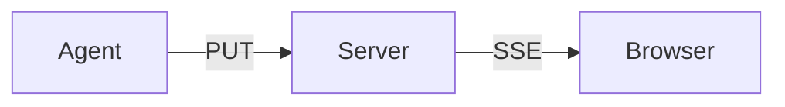

# AgentBoard — Grab Feature Spec

> **Status**: Draft. Proposes the design space before we lock a direction. Pick one of the three UX tracks in §5 and one copy format in §7, then we cut a Phase 1. Builds on v2 in `spec.md`; additive — existing projects keep working.

---

## 1. Motivation

AgentBoard is where agent work *terminates* — the dashboard is the sink for what the agent produced. Today there's no affordance to round-trip that content **back into a new prompt**. If a human wants to say "build a feature like X using the auth pattern from Y", they have to:

- Open the auth page, select text, copy
- Open the feature page, select text, copy (lose the first copy)
- Paste each separately, re-stitch in their prompt window

The workflow bleeds through an OS clipboard three times and loses structure on the way.

**The fix:** a mechanism to pick multiple sections across multiple pages and concatenate them into a single, formatted copy destined for another agent. Humans author the selection, the format is optimized for LLM consumption, one keystroke delivers.

---

## 2. Design principles

1. **Unobtrusive by default.** Readers shouldn't see a checkbox on every Card when they're just reading. Selection is an opt-in mode, not an always-on UI.
2. **The unit is the Card.** Cards already carry titles that are natural section headers. Text-range selection (highlighting prose inside a Card) is a future step, not Phase 1.
3. **Source fidelity over rendered text.** For a `<Mermaid>`, we copy the Mermaid source, not the SVG. For a `<Kanban>`, the raw task list, not the rendered columns. An agent can't reason about pixels.
4. **The user decides the format.** Copy as raw markdown, Claude-style XML, or structured JSON — same selection, three outputs.
5. **Zero new storage tier.** Selections live in `localStorage`. Saved bundles live in the existing KV store under a `bundles.*` namespace. No new database table.
6. **AI round-trip is a goal, not a gimmick.** Claude should be able to *create* a bundle via MCP and hand the user a pre-curated context pack — not just consume what the user built.

---

## 3. Non-goals

- **No text-range selection** in Phase 1. Card granularity only.
- **No rich editor** for tweaking bundles in-place. What you pick is what you get; edit in your agent's prompt window.
- **No OAuth / share-with-teammates**. Local mode only; cross-device sharing is Phase 3 (needs auth anyway).
- **No automatic summarization**. We copy source faithfully; we don't call an LLM to compress it. That's the *next* agent's job.
- **No file uploads included.** `<Image>` and `<File>` references in the bundle become URLs + filenames; the agent fetches if it needs the bytes.

---

## 4. The core concept

A **bundle** is an ordered list of picks. A **pick** identifies one Card on one page:

```ts
type Pick = {
  page: string        // "/features/auth"
  cardId: string      // stable slug derived from title+position, e.g. "setup"
  cardTitle?: string  // cached display name
}
```

A **materialized bundle** is what the server produces when asked to format a bundle:

```ts
type MaterializedSection = {
  page: string
  pageTitle: string
  cardTitle: string
  mdxSource: string      // raw MDX of the card's children
  components: Array<{    // resolved data for every component in the card
    type: string         // "Mermaid", "Code", "Metric", …
    sourceKey?: string
    value: unknown       // the current data-key value
  }>
}
```

The server materializes on demand — nothing is pre-cached. Picks reference pages by path and cards by ID; as long as those exist, the materialization resolves.

---

## 5. UX approaches (pick one or combine)

### A. **Grab mode toggle** (primary recommendation)

A 🧲 icon in the sidebar flips the dashboard into "grab mode". Every Card gets a hover checkbox at top-right. Checked cards get a thin accent-colored border. A persistent tray docks to the bottom of the viewport showing `N items · [Copy as ▾] · [Clear] · [Save…]`.

- **Pros:** Discoverable (the toggle is visible); reader mode stays clean; the tray is the obvious export point.
- **Cons:** Two clicks to get into the mode; users have to remember to turn it off.

### B. **Cmd-click (keyboard-first power mode)**

Holding ⌘ (or ⇧ on Windows) while clicking anywhere in a Card adds it to the current bundle. A small floating pill (bottom-right) shows count + copy dropdown. Cmd+C with no text selected copies the current bundle.

- **Pros:** No mode switching; power-user-friendly; works during normal browsing.
- **Cons:** Hidden affordance — non-technical users won't discover it without onboarding. Can't coexist with ⌘+click open-in-new-tab on links inside cards.

### C. **Command palette**

⌘K opens a palette. User types to fuzzy-search across page titles + card titles. Multi-select via Tab/Enter. Arrow to `Copy as…` and pick format. Zero mouse.

- **Pros:** Fastest for users who know what they want; keyboard-native; works on pages you haven't scrolled to.
- **Cons:** Least discoverable for non-technical users; demands exact recall of titles.

### D. **Right-click "Add to bundle"** (universal augment)

Context-menu entry on every Card. Pairs with any of A/B/C.

- **Pros:** Native platform affordance; works on mobile long-press.
- **Cons:** Nothing stand-alone — needs a separate UI to view/export the collected bundle.

**Recommendation:** ship **A** (Grab mode) as the primary UX in Phase 1, with **D** (right-click) as a secondary entry point. Add **C** (palette) in Phase 2 once people know the feature exists. **B** (Cmd-click) clashes with link behavior inside Cards; skip.

---

## 6. Discoverability aids (orthogonal to the above)

- **Empty tray CTA**: when the grab mode is first enabled in a session, the tray shows "Pick a card — its contents go here".
- **First-use hint**: a one-time toast on the home page: "Need to hand context to another agent? Try 🧲 grab mode in the sidebar."
- **Status line in the tray**: "3 picks · ~820 tokens estimated" — so users know if they're about to exceed a model's context window.

---

## 7. Copy formats

The Copy dropdown offers three outputs from the same selection:

### Format 1 — **Markdown with source headers** (default)

Easy to read, universal, pastes cleanly into any prompt. Safe default.

```md
## Context from AgentBoard

### /features/auth — Setup

Shared-token middleware. Off by default…

```bash
agentboard --auth-token=$(openssl rand -hex 16)
```

### /features/files — Flow


```

### Format 2 — **Claude-style XML** (for Anthropic/Claude prompts)

Claude's prompting guide recommends `<document>` / `<section>` XML blocks. Zero parse ambiguity for the model.

```xml
<agentboard_context>
  <section page="/features/auth" title="Setup">
    <text>Shared-token middleware. Off by default…</text>
    <code language="bash">agentboard --auth-token=$(openssl rand -hex 16)</code>
  </section>
  <section page="/features/files" title="Flow">
    <mermaid>graph LR
  Agent -->|PUT| Server
  Server -->|SSE| Browser</mermaid>
  </section>
</agentboard_context>
```

### Format 3 — **Structured JSON**

For agents that want to parse before summarizing, or for chaining into other tools.

```json
{
  "bundle": "ad-hoc",
  "generated_at": "2026-04-20T...",
  "sections": [
    {
      "page": "/features/auth",
      "card": "Setup",
      "components": [
        { "type": "Code", "language": "bash", "value": "agentboard --auth-token=..." }
      ]
    }
  ]
}
```

**Modifier keys as format shortcuts** (nice-to-have):
- Click `Copy` → markdown (default)
- ⌥-click → XML
- ⇧-click → JSON

---

## 8. Creative extensions

### E1. **Saved bundles as named data keys**

A bundle can be named and persisted to `bundles.<slug>` in the KV store. The Save button on the tray prompts for a name. Saved bundles show up in a "Bundles" section on the homepage — one-click re-copy without re-picking. Natural because bundles *are* data; they're just Picks serialized to JSON.

```
bundles.auth-review = {
  name: "auth-review",
  description: "Everything about how we gate writes",
  picks: [
    { page: "/features/auth", cardId: "setup" },
    { page: "/features/auth", cardId: "transport-channels" },
    { page: "/seams", cardId: "tripwires" }
  ],
  created_at: "..."
}
```

### E2. **Claude pre-curates bundles via MCP**

`agentboard_create_bundle({name, picks})` — Claude creates a bundle for the user:

> *"I've prepared the context you'll need for this refactor. Visit [http://localhost:3000/bundle/refactor-ingest](http://localhost:3000/bundle/refactor-ingest) and click Copy."*

The `/bundle/<slug>` route renders a minimal page: the included sections + a giant Copy button. Inverts the flow: now Claude is handing the human a context pack, not just receiving one.

### E3. **Token budget**

Show estimated token count in the tray (4-char heuristic is good enough — just `length / 4`). Color-code: green < 8k, yellow < 32k, red < 100k. Lets users preempt "your message is too long for this model" before pasting.

### E4. **MCP direct send**

Instead of clipboard, a "Send to MCP" option POSTs the materialized bundle to a connected Claude session as a tool-call result. No copy/paste at all. Phase 3 — requires an MCP session registry we don't have yet.

### E5. **Permalink as content URL**

Bundle definitions compress to a URL fragment: `/?grab=base64url(JSON)`. Paste the URL to an agent that can fetch, it gets the exact materialized content. Works without auth as long as the server is reachable. Pairs well with hosted mode.

### E6. **Recency tracking**

Every copy action appends to `bundles.history` — a rolling log of "what the human pulled for which agent, when". Becomes a `<Log>` on the homepage: *"Last pull: 3 min ago — auth setup + file flow → Claude"*. Useful pattern for humans working across many agents.

### E7. **Card IDs derived from titles, not positions**

`cardId` should be the kebab-case of the Card's `title` prop. If two Cards on the same page share a title, append a disambiguating counter (`setup`, `setup-2`). Stable across page edits — picks survive reordering.

### E8. **"Just the data" mode**

Checkbox in the tray: "Include raw data too". When on, every Card's bound data-key values are inlined next to the component tags. Lets Claude answer "what's the current value of `dev.tests.passing`?" without needing tool-calls.

---

## 9. API surface

All additive; stable data/page/component contracts unchanged.

### REST

| Method | Path | Purpose |
| --- | --- | --- |
| `POST` | `/api/grab` | Take a list of picks, return the materialized bundle in the requested format. Body: `{picks, format}` where format ∈ `markdown` / `xml` / `json`. |
| `GET` | `/api/bundles` | List saved bundles (shorthand for `/api/data?prefix=bundles.`). |
| `GET` | `/api/bundles/:slug` | Materialize a saved bundle. Query `?format=xml` etc. |
| `PUT` | `/api/bundles/:slug` | Save a bundle — body is `{name, description?, picks}`. Mirrors existing page CRUD pattern. |
| `DELETE` | `/api/bundles/:slug` | Remove a saved bundle. |

### MCP

| Tool | What it does |
| --- | --- |
| `agentboard_list_bundles` | Read-only discovery. |
| `agentboard_read_bundle(slug, format?)` | Get the materialized content. Use format="xml" when Claude is feeding its own context. |
| `agentboard_create_bundle({name, picks})` | Claude pre-curates for the user (see E2). |
| `agentboard_delete_bundle(name)` | Cleanup. |

That's 4 new tools. 18 → 22. `CORE_GUIDELINES.md` §2.3 needs to note this expansion.

### Frontend hooks

- `useGrab()` — returns `{picks, add, remove, clear, save, isGrabMode, setGrabMode}`. Backed by `localStorage` so picks survive refresh.

### Components

One new built-in: **`<Bundles>`**. Renders the list of saved bundles from `bundles.*` with one-click "Open" and "Copy directly" buttons. Good fit on the homepage. Catalog grows 20 → 21.

---

## 10. Selection identity: how Cards get IDs

Pages today don't expose stable Card identifiers — `<Card title="X">` is a React prop, not a URL target. To make picks stable we:

1. **Auto-slug the title**: `setup`, `live-metrics`, `inline-image`. Kebab-case, unicode-normalized.
2. **Disambiguate dupes**: page scans its own rendered tree during compile, emits `-2`, `-3` suffixes where titles collide.
3. **Wrap each Card in `<div id="<slug>" data-card-title="..." data-card-page="...">`**: gives us the anchor (`/foo#setup`), the data for the picker, and future extensibility.

This means the **current `Card` component gains metadata props**, not new visible behavior. No migration for pages already authored.

---

## 11. Storage & lifecycle

| State | Where it lives | Lifetime |
| --- | --- | --- |
| Current in-progress picks | `localStorage['agentboard:grab']` | Per-browser; cleared on Clear or explicit logout |
| Saved bundles | SQLite via data store (`bundles.<slug>`) | Persistent; same retention as all data |
| Recency log | `bundles.history` (array, cap 50) | Persistent, rolling |
| Grab mode on/off | `localStorage['agentboard:grab-mode']` | Per-browser |

No new tables, no new migrations.

---

## 12. Failure modes

- **Pick references a deleted page/card** → materialize skips it, emits a warning in the output (`<!-- skipped: /features/foo#setup (not found) -->`). Never blocks the copy — the rest of the selection still goes out.
- **Saved bundle references a page that moved** → same treatment. Phase 2 could add a "repair" UI.
- **User hits system clipboard-size limits** (~ a few MB) → warn in tray before Copy if estimated size is huge.
- **Component with no serializable source** (e.g. a custom user component that doesn't follow `source=` conventions) → materialize emits `<!-- component X could not be grabbed -->` and carries on.

---

## 13. Implementation phases

**Phase 1 (ship it):**
- Card ID assignment (§10).
- `useGrab` hook + `GrabTray` component + sidebar toggle (UX approach A).
- `POST /api/grab` with markdown + XML + JSON formats.
- One new MCP tool: `agentboard_grab({picks, format})` (callable by users *through* Claude — "grab what I have on the dashboard about auth").
- Homepage gets a `<Bundles />` card listing saved bundles (once E1 lands, even if empty initially).

**Phase 2 (saved bundles + discoverability):**
- `PUT /api/bundles/:slug`, save/load from tray.
- 3 more MCP tools (list, read, create, delete).
- Token-budget meter in the tray (E3).
- Command palette (UX approach C).

**Phase 3 (after hosted + auth):**
- Permalink-as-content URL (E5).
- MCP direct-send (E4).
- Recency tracking (E6).
- Mobile long-press via right-click affordance (UX approach D).

---

## 14. Open questions

### Q1 — grab mode scope
Is grab mode a **per-browser** setting (off on a fresh tab) or **per-project** (sticky)? Default: per-browser, off on new tab. Power users who live in the feature can script a URL param to force it on.

### Q2 — the "paste" assumption
The spec assumes the user pastes into an agent's input box. Should we *also* expose a `?destination=claude://...` deep link that opens the user's connected agent with the bundle pre-loaded? Possible for Claude Desktop and a few others; very niche.

### Q3 — format default
Markdown is the safe default today but Claude-XML likely produces better context for Claude specifically. If we detect the user's active agent (hard without OS hooks), we could flip the default. Too clever for Phase 1.

### Q4 — rendered-vs-source for text cards
A Card containing paragraphs of MDX has two shapes: the raw markdown source vs the rendered HTML-to-text. Both are useful; Markdown format already favors source. Should XML format favor rendered text for prose-heavy cards? Probably yes — "render the prose, inline the components".

### Q5 — what counts as a "card"
Pages author content with `<Card>` wrappers, but not every section is wrapped. Should an `<h2>` with no Card wrapping also be grabbable? Default: **no** — only `<Card>`s are grabbable. Keeps the rule simple and forces good page structure. If this bites, we add `<h2>` later.

### Q6 — naming
Working name is **Grab** (`agentboard_grab`, `useGrab`, `/api/grab`). Alternatives: **Snap**, **Pickup**, **Bundle**, **Context Cart**. **Grab** reads as both verb and noun, matches the user's phrasing ("grabbing context"), pairs naturally with an emoji (🧲 / 🤏 / 👇). Unless someone objects, we ship with Grab.

---

**End of spec.**
